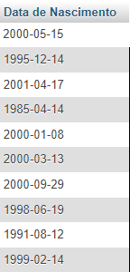

# Exercícios de Banco de Dados - Etapa 3

## 1) Faça uma consulta que mostre os alunos que nasceram antes do ano 2009
```sql
SELECT data_nascimento AS 'Data de Nascimento' FROM alunos 
WHERE YEAR(data_nascimento) < 2009;
```


## 2) Faça uma consulta que calcule a média das notas de cada aluno e as mostre com duas casas decimais.

```sql
SELECT nome, ROUND(AVG((primeira_nota + segunda_nota) / 2), 2) As 'Média dos Alunos'
FROM alunos
GROUP BY id;
```


## 3) Faça uma consulta que calcule o limite de faltas de cada curso de acordo com a carga horária. Considere o limite como 25% da carga horária. Classifique em ordem crescente pelo título do curso.

```sql
SELECT titulo, ROUND(carga_horaria * 0.25) AS 'Limite de Faltas'
FROM cursos
ORDER BY titulo ASC;
```


## 4) Faça uma consulta que mostre os nomes dos professores que são somente da área "desenvolvimento".

```sql
SELECT nome AS Docente
FROM professores
where area_atuacao = 'desenvolvimento';
```


## 5) Faça uma consulta que mostre a quantidade de professores que cada área ("design", "infra", "desenvolvimento") possui.

```sql
SELECT area_atuacao AS 'Área de Atuação', COUNT(*) AS 'QTD de Docentes'
FROM professores
GROUP BY area_atuacao;
```


## 6) Faça uma consulta que mostre o nome dos alunos, o título e a carga horária dos cursos que fazem.

```sql
SELECT alunos.nome AS Alunos, cursos.titulo AS Disciplina, cursos.carga_horaria AS 'Carga Horária'
FROM alunos INNER JOIN cursos
ON alunos.curso_id = cursos.id;
```


## 7) Faça uma consulta que mostre o nome dos professores e o título do curso que lecionam. Classifique pelo nome do professor.

```sql
SELECT professores.nome AS Professores, cursos.titulo AS Disciplina
FROM professores INNER JOIN cursos
ON professores.curso_id = cursos.id
GROUP BY nome;
```


## 8) Faça uma consulta que mostre o nome dos alunos, o título dos cursos que fazem, e o professor de cada curso.

```sql
SELECT alunos.nome AS Alunos, cursos.titulo AS Disciplina, professores.nome AS Professores
FROM alunos INNER JOIN cursos
ON alunos.curso_id = cursos.id
INNER JOIN professores 
ON cursos.professor_id = professores.id
```


## 9) Faça uma consulta que mostre a quantidade de alunos que cada curso possui. Classifique os resultados em ordem descrecente de acordo com a quantidade de alunos.

```sql
SELECT
    cursos.titulo AS Cursos,
    COUNT(alunos.curso_id) AS "QTD de Alunos"
FROM cursos INNER JOIN alunos
ON alunos.curso_id = cursos.id
GROUP BY alunos.curso_id
ORDER BY Cursos DESC;
```


## 10) Faça uma consulta que mostre o nome dos alunos, suas notas, médias, e o título dos cursos que fazem. Devem ser considerados somente os alunos de Front-End e Back-End. Mostre os resultados classificados pelo nome do aluno.

```sql
SELECT alunos.nome AS Alunos, alunos.primeira_nota AS 'Primeira Nota', alunos.segunda_nota AS 'Segunda Nota', ROUND(AVG((alunos.primeira_nota + alunos.segunda_nota) / 2), 2) As 'Média dos Alunos',   cursos.titulo AS Disciplina
FROM alunos INNER JOIN cursos
ON alunos.curso_id = cursos.id
WHERE cursos.titulo LIKE '%Front_End%' OR cursos.titulo LIKE '%Back_End%'
GROUP BY alunos.nome;
```


## 11) Faça uma consulta que altere o nome do curso de Figma para Adobe XD e sua carga horária de 10 para 15.

```sql
UPDATE cursos
SET titulo = 'Adobe XD', carga_horaria = 15
WHERE id = 4
AND id = (SELECT id FROM cursos WHERE id = 4);
```


## 12) Faça uma consulta que exclua um aluno do curso de Redes de Computadores e um aluno do curso de UX/UI.

```sql
DELETE FROM alunos
WHERE id = 10 OR id = 3;
```


## 13) Faça uma consulta que mostre a lista de alunos atualizada e o título dos cursos que fazem, classificados pelo nome do aluno.

```sql
SELECT alunos.nome AS Alunos, cursos.titulo AS Cursos
FROM alunos INNER JOIN cursos
ON alunos.curso_id = cursos.id
GROUP BY Alunos;
```


# DESAFIOS

1) Criar uma consulta que calcule a idade do aluno

```sql
SELECT nome, data_nascimento, TIMESTAMPDIFF(YEAR, data_nascimento, CURDATE()) as ano FROM alunos LIMIT 0, 25;
```


2) Criar uma consulta que calcule a média das notas de cada aluno e mostre somente os alunos que tiveram a média **maior ou igual a 7**.

```sql
SELECT nome AS Alunos, ROUND(AVG((primeira_nota + segunda_nota) / 2), 2) AS MediaDosAlunos
FROM alunos
GROUP BY id
HAVING MediaDosAlunos >= 7;
```


3) Criar uma consulta que calcule a média das notas de cada aluno e mostre somente os alunos que tiveram a média **menor que 7**.

```sql
SELECT nome AS Alunos, ROUND(AVG((primeira_nota + segunda_nota) / 2), 2) AS MediaDosAlunos
FROM alunos
GROUP BY id
HAVING MediaDosAlunos < 7;
```


4) Criar uma consulta que mostre a quantidade de alunos com média **maior ou igual a 7**.

```sql
SELECT COUNT(*) AS 'QTD de Alunos'
FROM alunos
HAVING AVG((primeira_nota + segunda_nota) / 2) >= 7;
```
